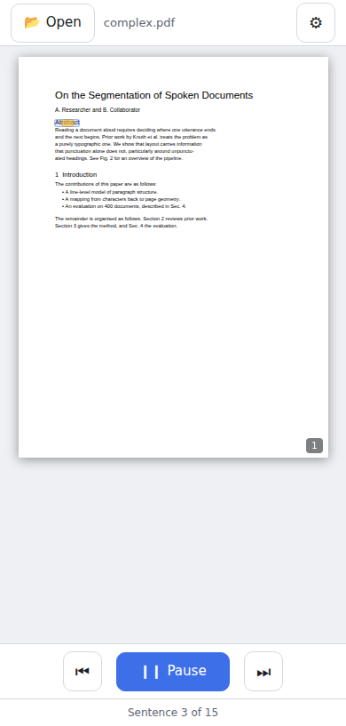

# Speechify

A website that reads a PDF out loud and highlights what it is saying — the
current sentence as a wash, and the word being spoken as a marker inside it.
No install: open it in a browser, on desktop or on a phone.

Built with [pdf.js](https://mozilla.github.io/pdf.js/) for rendering and text
extraction, and the browser's own speech synthesiser for the voice — nothing
is uploaded anywhere; the PDF never leaves your device.



## Running it locally

```sh
npm install
npm start
```

Opens at `http://localhost:5173`. Pick a PDF from the file picker, or tap any
sentence once it's open to start reading from there.

|  |  |
|---|---|
| **Tap / click a sentence** | start reading from there |
| **Space** | play / pause |
| **← →** | previous / next sentence |
| **Esc** | stop |
| **⚙ / the settings panel** | voice, speed, zoom |

### Voices

The site speaks through whatever voices the browser and operating system
provide — there is no server-side or cloud voice. Chrome and Edge on desktop,
and Safari on iOS/macOS, ship usable voices out of the box. Two things worth
knowing:

- **iOS Safari does not report word-boundary events.** Sentence highlighting
  still works there; the word-level marker just never appears. The app
  detects this and says so in the empty state.
- If no voices are found at all, the app says so in the status bar and the
  play button stays disabled — the document still opens and can be read on
  screen.

## Deploying it

`web/dist/` is a fully static site — no server-side code, no build step at
request time. Any static host works:

```sh
npm run build:web        # writes web/dist/
```

Then point your host at `web/dist/` — GitHub Pages, Netlify, Vercel, Cloudflare
Pages, or a plain `nginx`/`python -m http.server` all work unmodified, since
it's just HTML, CSS, JS and the pdf.js assets.

## How it works

Reading a PDF aloud *and* tracking the reading position means solving three
problems that pdf.js leaves to the caller.

**1. Recovering prose from a page.** `getTextContent()` returns text in
content-stream order, split wherever the PDF happened to split it — mid-word
for kerning, mid-line for a font change. `src/core/text-model.js` regroups
those fragments into visual lines, then decides what separates each line from
the next: a space for a wrapped sentence, nothing for a word hyphenated across
a break, or a hard break for a heading, a bullet or a new paragraph. That last
decision uses the geometry (line spacing, a change of font size, a line that
stops well short of the measure) because punctuation alone cannot tell a
heading from the sentence beneath it.

**2. Choosing what to speak.** Units are sentences, from `Intl.Segmenter`, with
two corrections: splits caused by abbreviations and initials — `Dr.`, `et al.`,
`Fig. 2`, `A. Researcher` — are stitched back together, and very long sentences
are broken at clause boundaries so an utterance stays short enough to start
promptly and cheap enough to restart.

**3. Mapping characters back to the page.** Every character of the extracted
text keeps a link to the text item it came from, so any character range can be
turned into rectangles and merged into one box per line. Sub-ranges are
measured with a table of glyph advances rather than by character count, which
is what keeps the word marker on the word instead of drifting across it.

With that in place the playback loop is small: `Reader` (`src/speech/reader.js`)
hands the synthesiser one sentence at a time — plus one queued ahead, so there
is no gap between them — and the browser's `start` and `boundary` events say
which sentence and which character are being spoken right now. Those turn
straight back into rectangles. Jumping to an arbitrary sentence (tapping one,
or the next/previous buttons) re-anchors that queue to the new position rather
than replaying everything between the old spot and the new one — a real bug
here at one point, now pinned down by a regression test.

### Layout

```
src/
  core/       pure logic, no DOM: text model and geometry
  viewer/     pdf-document.js (loading), page-view.js (rendering)
  speech/     reader.js (playback state), web-speech-engine.js
web/
  index.html, mobile.css, app.js   the site itself — a touch-first layout
  build.mjs                        assembles web/dist/ (no bundler; plain ES modules)
  serve.mjs                        a tiny static server for local dev
test/
  *.test.mjs      unit tests over generated PDF fixtures
  e2e/web-smoke.js   boots the built site in a plain, unprivileged browser
                      context and drives it end to end
```

`core/`, `speech/` and `viewer/` have no dependency on the browser chrome
around them — `web/app.js` is the only file that wires them to the DOM. That
split is what keeps the logic unit-testable under `node --test` without a
browser at all.

### Known limits

- **Scanned PDFs have no text to read.** The page renders and the app says so,
  but read-aloud needs OCR, which is out of scope here.
- **Changing voice or speed restarts the current sentence.** Those settings are
  fixed when an utterance is created, so they cannot take effect mid-sentence.
- **Word highlighting depends on `boundary` events.** Browsers that do not emit
  them (notably iOS Safari) still get sentence highlighting, which is the
  load-bearing cue.
- **Multi-column layouts are read in pdf.js's order**, which is usually but not
  always column order.
- **Nothing persists across devices.** Preferences (voice, speed, zoom) are
  saved to `localStorage` in the browser you're using; there's no account or
  sync.

## Development

```sh
npm test          # unit tests (node --test)
npm run test:web  # builds web/dist and drives it in a real, unprivileged
                   # browser context — no bridge, no Node integration, only
                   # the speech synthesiser is stubbed (CI has no voices)
npm run fixtures  # regenerate the PDF fixtures in test/fixtures
```

The unit tests run against PDFs generated by `test/fixtures/make-pdf.mjs`, one
plain and one carrying the layout cases that make segmentation hard (headings
with no terminating punctuation, hyphenated line breaks, bullets, abbreviations
that must not end a sentence). The e2e test boots the actual built site the
way a browser would — a file picked from disk, real DOM assertions on the
resulting highlights and geometry — with only `speechSynthesis` stubbed.
